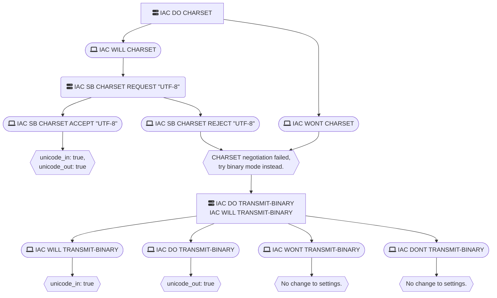
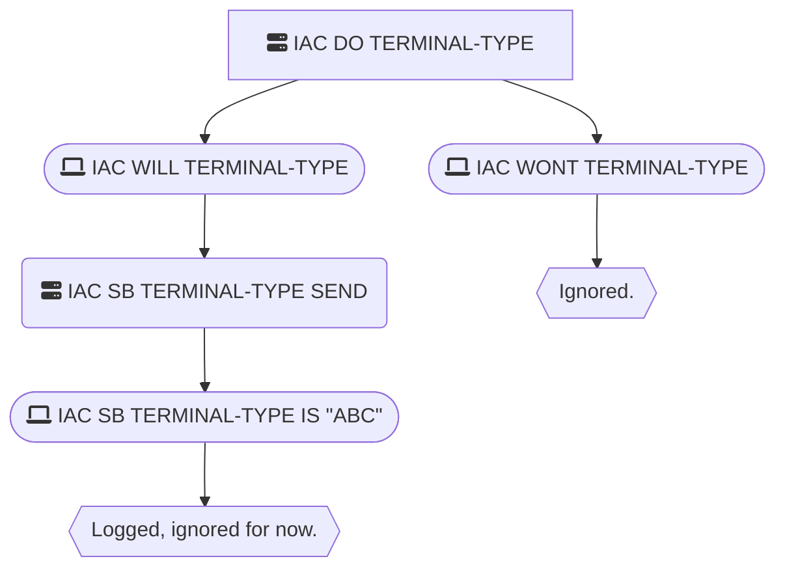
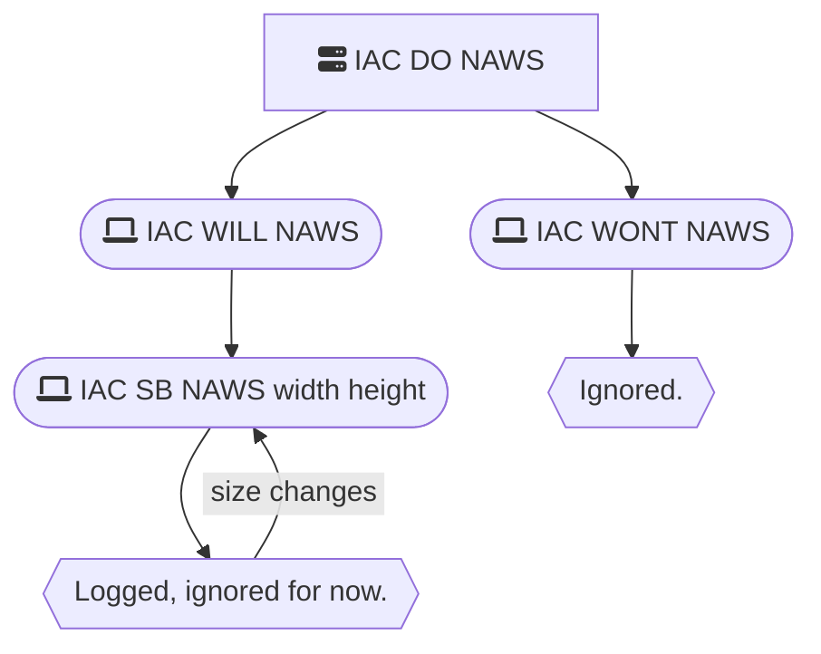

# Telnet Option Negotiation

Just a quick sketch of how ExMUSH handles telnet option negotiation.

## Unicode Output

## Terminal Type

Not currently used, but will be important for auto-detecting ANSI capabilities later.

## Notify About Window Size (NAWS)

Not currently used, but could be useful later in MUSHcode.

